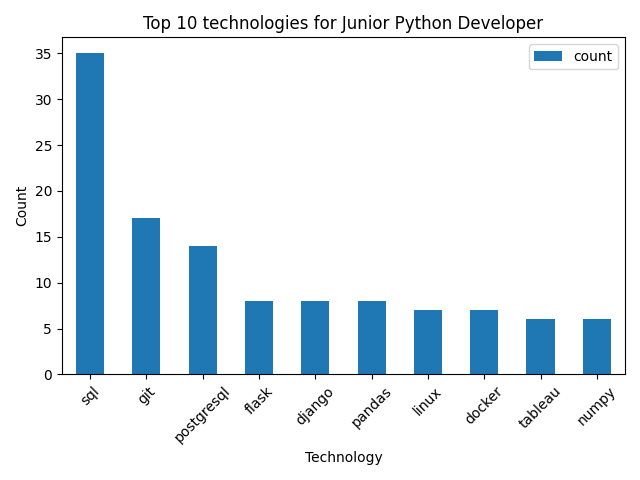

# Job technologies analyzer
This is an app to analyze most demanded technologies in job vacancies for different experience levels.

## Features
You can run a scraper to parse vacancies. 
After scraping, you can visualize data on the 2 types of diagrams: bar plot and pie chart.

### Additional info
* All visualizations are saved in the `plots` folder.
* In config.py you can set different experience levels and technologies to analyze.

## Installing using GitHub
Python should be installed

```shell
git clone https://github.com/MarianKovalyshyn/job-technologies-analyzer.git
cd job-technologies-analyzer/
python -m venv venv
source venv/bin/activate (MacOS)
venv\Scripts\activate (Windows)
pip install -r requirements.txt
scrapy crawl technologies -O vacancies.csv
python main.py
```

## Example of diagram

